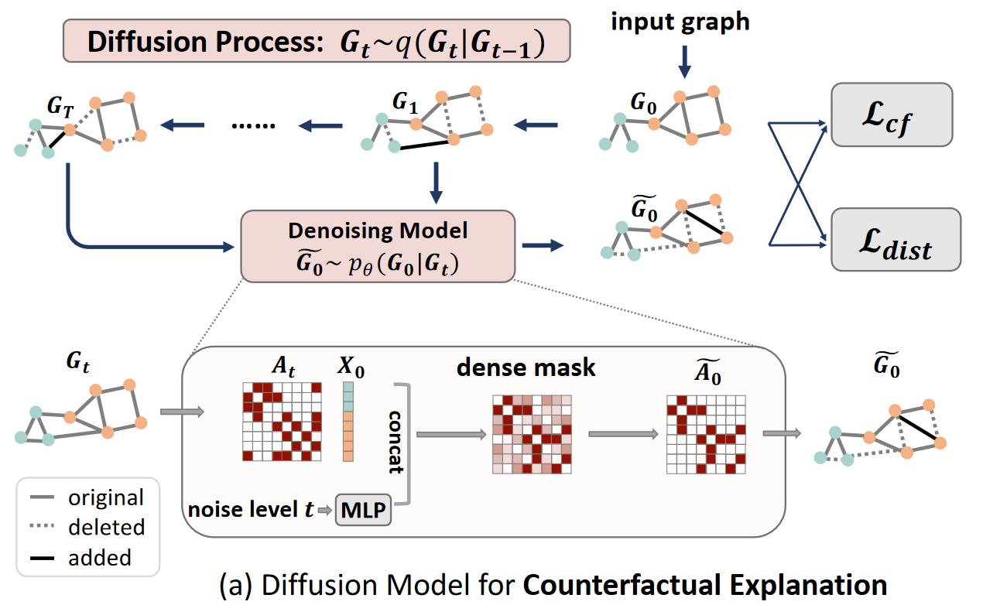
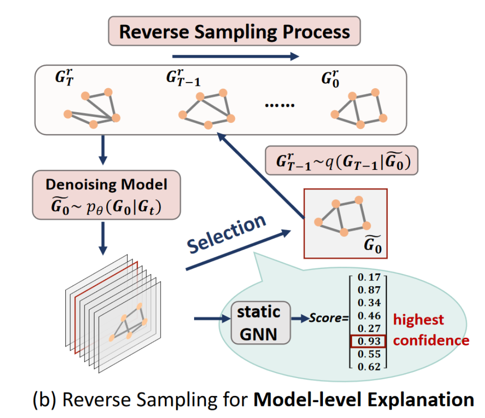

# Objective of Paper
- Current explanation methods for GNNs have trouble with counterfactual and model-level explanations.
  - Counterfactual explanations are the opposite of factual explanations; whereas factual explanations ask an explanation for the graph provided, counterfactual explanations ask: "Which changes in the input graph would result in a different outcome?". Counterfactual explanations are useful for explaining how changes in the input effect the output.
  - Model-level explanations build on top of instance-level explanations; whereas instance-level explanations ask for an explanation given an individual, specific graph, model-level explanations are explanations that hold for all possible input graphs in general. Model-level explanations are useful for explaining the general decision-making of a GNN.
  - Formally, let $f$ be the GNN that should be explained, and let $G$ be the graph that is the input to $f$. Then $f(G)$ gives the label predicted by the GNN for the graph, denoted as $\hat{Y}_G$. 
    - A counterfactual explanation $G^c$ of $f$ can then be defined as a problem of finding the minimal difference between $G$ and $G^c$ that results in $\hat{Y}_G \neq \hat{Y}_{G^c}$.
    - A model-level explanation $G^m$ of $f$ can then be defined as a problem of finding the arguments of the maximum for the likelihood of a certain label being predicted by the GNN given the graph: $\arg\max_G P_f(Y|G)$.
- A reason for this is that current GNN explainability methods rely on methods that may produce out-of-distribution input graphs.
  - GNNs are trained on a collection of graphs. These graphs come from a certain distribution, just like all data. Often, graphs from these distributions also follow certain domain-specific rules. For example, graphs of molecules for the designing of drugs must adhere to certain domain-specific rules in order to be considered valid.
  - For GNN explainability, we want to point to specific subgraphs of the input graph. We want to be able to pinpoint the specific neighborhood of nodes that results in specific decision-making of the GNN.
  - Current GNN explainability methods rely on the construction or generation of subgraphs that explain decision-making for a graph. However, these methods may produce subgraphs that do not fall within the distribution of the input graphs. These are out-of-distribution (sub)graphs.
- Graph diffusion models are a recent development capable of generating (sub)graphs from noise that are in-distribution.
  - In diffusion, noise is introduced step-wise to the input until the input is all noise. Then, a model attempts to learn to remove the noise introduced in every step by going through the steps backwards, removing noise as it goes. After training, a diffusion model can be supplied a collection of noise and "denoise" it, even if the noise is purely random and does not exist on top of an input. This means that diffusion models can generate data based on noise. A well-known example is the generation of images from noise.
  - The diffusion process can also be applied to graphs: noise is introduced step-wise to a graph, then a model learns to remove the noise at every step. After training, the model is able to generate graphs from noise.
  - Since the diffusion model is trained unsupervised on a dataset, learning to approximate the distribution of the data it trained on, diffusion models are capable of generating in-distribution data for many kinds of data, including images and graphs.
  - Formally, let $t \in [0, T]$ be the current timestep, and thus noise level, of the forward diffusion, $A_t$ the (one-hot encoded) adjacency matrix of the graph at timestep $t$, $a_t^{ij} \in A_t$ the (one-hot encoded) existence of an edge between nodes $i$ and $j$ at timestep $t$, $Q_t \in \mathbb{R}^{2 \times 2}$ the stochastic matrix that defines how noise is introduced at timestep $t$ (since the forward diffusion process is a Markov chain), and $Cat(x; P)$ the categorical distribution over the (one-hot encoded) vector $x$ and probability vector $P$.
    - Then the forward diffusion process of a node $a_t^{ij}$ can be written as a function of the presence of a node at the current timestep given the presence of the node at the prior timestep: $q(a_t^{ij} | a_{t-1}^{ij}) = Cat(x = a_t^{ij}; P = a_{t-1}^{ij}Q_t)$.
    - Since the forward diffusion process of the graph $G$ is identical to the forward diffusion process over all edges in $A_t$, it can be described as a function of the graph at the current timestep given the graph at the prior timestep: $q(G_t|G_{t-1}) = \prod_{ij} q(a_t^{ij}|a_{t-1}^{ij})$.

# Proposal Made
- The proposal made by the authors is D4Explainer.
  - D4Explainer is a graph diffusion model. D4Explainer is trained using the diffusion process. In the forward diffusion process, noise is added step-wise to an in-distribution graph. This noise consists of the addition and/or removal of edges. In the backwards denoising process, the model learns to step-wise remove this noise. 
  - By including both generative graph distribution learning and the preservation of the counterfactual property into the model's loss function, the model can be learned to generate in-distribution subgraphs that serve as counterfactual explanations.
  - When trained on eight different datasets, D4Explainer has shown state-of-the-art performance for counterfactual and model-level explanations of GNNs. It achieves a counterfactual accuracy of over 80% when only 5% of the edges are modified. Compared with baselines of GNN explanation models, D4Explainer's explanations come closest to the datasets' original distributions.
  - D4Explainer is only capable of discrete structural diffusion. Diffusion over continuous features is explicitly not considered.
- The proposal offers three contributions:
  1. Using the diffusion process, a model is taught to generate in-distribution graphs from noise. These graphs are then in-distribution, diverse, and robust explanations of a GNN's decision-making.
  2. By allowing the addition of edges in a graph during the diffusion process, the diffusion model can be taught to give counterfactual explanations, since it learns how small changes in graph structure changes predictions. This provides a high-level understanding of the effect of edge addition in counterfactual explanations.
  3. The diffusion model is the first graph diffusion model capable of both counterfactual and model-level explanations that are faithful.
- D4Explainer is capable of counterfactual explanations of GNNs.

  - The counterfactual explanation of a GNN starts with a forward diffusion process. The graph $G$ that is the input of the GNN that should be counterfactually explained is taken to be the first step of the forwards diffusion process $G_0$. At every timestep $t \in [0, T]$, noise is added to the graph. This noise is random removal and/or addition of edges between nodes. This means that every $G_{t+1}$ is $G_t$ with new edges added and/or removed. At the end of the forwards diffusion process, we get the fully noisy graph $G_T$. Every graph generated during the forwards diffusion process is used as an input for the denoising process, one graph at a time, going backward from $G_T$.
  - *Denosing process*
  - *Loss function*
- D4Explainer is capable of model-level explanations of GNNs.

  - skunk

# Evidence Given

# Shoulders of Giants
## GNN Explainability
- [6] [GNNExplainer: Generating Explanations for Graph Neural Networks](https://arxiv.org/abs/1903.03894) (2019)
  - Early foundational paper on explainability of GNNs.
- [8] [Parameterized Explainer for Graph Neural Network](https://arxiv.org/abs/2011.04573) (2020)
  - A parameterized approach to GNN explainability using deep nets.
- [9] [PGM-Explainer: Probabilistic Graphical Model Explanations for Graph Neural Networks](https://arxiv.org/abs/2010.05788) (2020)
  - A probabilistic graphical model approach to GNN explainability, similar to Bayesian networks.
- [10] [DAG Matters! GFlowNets Enhanced Explainer For Graph Neural Networks](https://arxiv.org/abs/2303.02448) (2022)
  - A generative flow network approach to GNN explainability.
- [11] [Reinforcement Learning Enhanced Explainer for Graph Neural Networks](https://proceedings.neurips.cc/paper/2021/hash/be26abe76fb5c8a4921cf9d3e865b454-Abstract.html) (2021)
  - A reinforcement learning net approach to GNN explainability.

## Graph Diffusion Models
- [19] [DiGress: Discrete Denoising diffusion for graph generation](https://arxiv.org/abs/2209.14734) (2022)
  - A proposed model for the generation of discrete graphs based on the diffusion process.
- [20] [Diffusion Models for Graphs Benefit From Discrete State Spaces](https://arxiv.org/abs/2210.01549) (2022)
  - Discrete graph diffusion using discrete noise samples as opposed to continuous Gaussian samples.
- [44] [Conditional Diffusion Based on Discrete Graph Structures for Molecular Graph Generation](https://arxiv.org/pdf/2301.00427.pdf) (2023)
  - An example of conditional diffusion models used for the generation of in-distribution graphs.

# Impact

# Reproducibility

# Conclusion